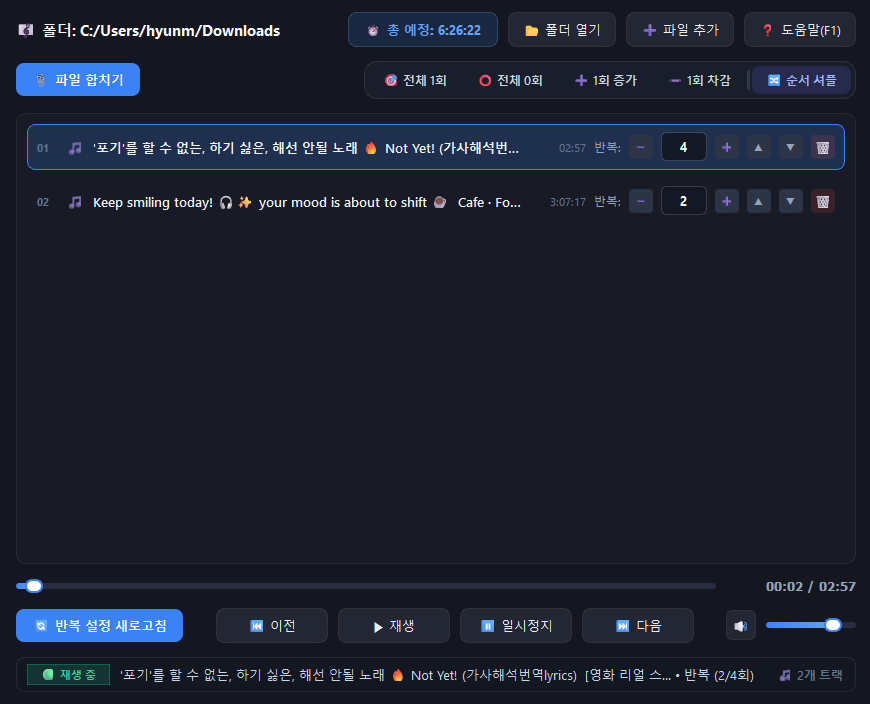

#  Repeat Music Player

## 🚀 Overview

PySide6 기반의 **음악 트랙별 개별 반복 재생 & 통합 병합 유틸리티**입니다.  
여러 음원 파일(.mp3, .wav, .flac, .ogg, .m4a 등)을 불러와 **각 곡마다 원하는 반복 횟수(0회~999회)를 자유롭게 지정**하여 순차적으로 정밀 반복 재생할 수 있으며, 설정된 반복 횟수와 순서가 정확히 반영된 **단일 오디오 파일로 일괄 병합(Concat)** 추출하는 편리한 프리셋 기능을 제공합니다.

## 🛠️ Built With

<picture>
  <source media="(prefers-color-scheme: dark)" srcset=".github/readme/badges/dark/windows.png">
  <source media="(prefers-color-scheme: light)" srcset=".github/readme/badges/light/windows.png">
  
</picture>
<picture>
  <source media="(prefers-color-scheme: dark)" srcset=".github/readme/badges/dark/python.png">
  <source media="(prefers-color-scheme: light)" srcset=".github/readme/badges/light/python.png">
  
</picture>
<picture>
  <source media="(prefers-color-scheme: dark)" srcset=".github/readme/badges/dark/pyside6.png">
  <source media="(prefers-color-scheme: light)" srcset=".github/readme/badges/light/pyside6.png">
  
</picture>
<picture>
  <source media="(prefers-color-scheme: dark)" srcset=".github/readme/badges/dark/pyinstaller.png">
  <source media="(prefers-color-scheme: light)" srcset=".github/readme/badges/light/pyinstaller.png">
  
</picture>

## 🖥️ Preview

<p align="center">
  
</p>

## ✨ Key Features

- **🔁 트랙별 반복 횟수 지정**: 각 음원별 0~999회 정밀 반복 횟수 자유 설정
- **🎯 원클릭 프리셋 & 셔플**: 일괄 횟수 조절(`1회`/`0회`/`+1`/`-1`) 및 순서 무작위 셔플
- **🔀 순서 이동 & 윈도우 탐색기**: `▲`/`▼` 트랙 순서 정렬 및 익숙한 Windows 순정 탐색기 제공
- **📎 FFmpeg 오디오 병합**: 반복 횟수와 순서가 반영된 단일 음원 파일(.mp3 등) 추출
- **⌨️ 직관적인 단축키**: `Space` (재생/일시정지), `←`/`→` (이동), `↑`/`↓` (볼륨), `F1` (도움말)

## 📂 Project Structure

```text
MINI_RepeatMusicPlayer/
┣━━ 📂 .github/                   # README 이미지 및 뱃지 자산 (logo, preview, badges)
┣━━ 📂 assets/                    # 아이콘·Pretendard 폰트 (FFmpeg는 로컬 전용, git 미포함)
┣━━ 📄 RepeatMusicPlayerApp.py    # 프로그램 진입점, Pretendard 폰트 및 단일 인스턴스 훅
┣━━ 📄 RepeatMusicPlayerCore.py   # 음원 스캔, 재생 큐, ffprobe duration, FFmpeg Concat
┣━━ 📄 RepeatMusicPlayerUi.py     # PySide6 메인 UI, 트랙 행 커스텀 위젯 및 스마트 말줄임 라벨
┣━━ 📄 build.bat                  # Portable Executable 자동 빌드 스크립트
┣━━ 📄 requirements.txt           # 필수 의존성 목록 (PySide6, PyInstaller, Pillow)
┣━━ 📄 .gitignore                 # Git 제외 파일 설정
┗━━ 📄 README.md                  # 프로젝트 설명 문서
```

## ⚙️ Getting Started

### 📋 Prerequisites (사전 요구사항)
- **OS**: Windows 10 / 11
- **Python**: Python 3.10+ 권장
- **FFmpeg** (파일 합치기 / duration 측정): PATH에 `ffmpeg`·`ffprobe`가 있거나, 로컬에 `assets/ffmpeg/ffmpeg.exe`·`ffprobe.exe`를 두면 됩니다.  
  > ⚠️ 바이너리(~170MB)는 저장소에 포함하지 않습니다. 직접 받아 `assets/ffmpeg/`에 배치하거나 시스템에 설치하세요.

### 1. 소스 코드 직접 실행 (Run from Source)

```bash
# 1. 저장소 클론
git clone https://github.com/Hyeonseok93/MINI_RepeatMusicPlayer.git
cd MINI_RepeatMusicPlayer

# 2. 가상 환경 생성 및 활성화 (권장)
py -3 -m venv .venv
.venv\Scripts\activate

# 3. 필수 의존성 설치
pip install -r requirements.txt

# 4. 애플리케이션 실행
python RepeatMusicPlayerApp.py
```

### 2. 포터블 실행 파일(.exe) 빌드 (Build Portable Executable)

프로젝트 루트의 `build.bat`을 실행하면 가상 환경(`.venv`) 생성, 의존성 설치, 빌드 및 임시 폴더 정리를 거쳐 `RepeatMusicPlayer.exe` 단일 포터블 실행 파일을 생성합니다.

```cmd
build.bat
```

> 💡 빌드가 완료되면 생성된 **`RepeatMusicPlayer.exe`** 파일만 추출하여 무설치 포터블로 사용할 수 있습니다.

## 📄 License

This project is licensed under the MIT License.
